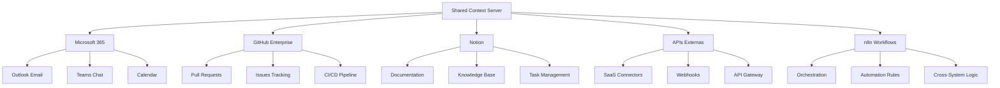

# Enterprise Integration Hub

🚀 **Sistema Completo de Integración Empresarial**

Un centro neurálgico de integración empresarial que coordina múltiples sistemas externos usando Shared Context Server como base para automatización inteligente.

## 🏗️ Arquitectura del Sistema



## 🔌 Integraciones Disponibles

### Microsoft 365
- ✅ **Outlook**: Email empresarial automatizado
- ✅ **Teams**: Colaboración en tiempo real
- ✅ **Calendar**: Gestión de reuniones y eventos
- ✅ **SharePoint**: Documentos empresariales

### GitHub Enterprise
- ✅ **Pull Requests**: Workflow de revisión de código
- ✅ **Issues**: Gestión de incidencias y bugs
- ✅ **Actions**: Integración CI/CD completa
- ✅ **Projects**: Gestión de proyectos ágiles

### Notion
- ✅ **Bases de Conocimiento**: Documentación centralizada
- ✅ **Task Management**: Seguimiento de tareas
- ✅ **Collaboration**: Edición colaborativa en tiempo real
- ✅ **Databases**: Bases de datos estructuradas

### APIs Externas
- ✅ **SaaS Connectors**: Conexión con servicios cloud
- ✅ **Webhooks**: Notificaciones en tiempo real
- ✅ **REST APIs**: Integración con sistemas legacy
- ✅ **GraphQL**: Consultas eficientes a datos

### n8n Workflows
- ✅ **Orchestration**: Coordinación de múltiples sistemas
- ✅ **Automation Rules**: Lógica de negocio automatizada
- ✅ **Cross-System Logic**: Workflows跨-sistema complejos
- ✅ **Monitoring**: Dashboard de monitoreo en tiempo real

## 🚀 Quick Start

### Prerrequisitos
- Shared Context Server corriendo en `http://localhost:23456`
- n8n disponible en `http://localhost:5678`
- PostgreSQL para persistencia de datos
- Cuentas de servicio configuradas

### Instalación

```bash
# Clonar repositorio
git clone https://github.com/omanzanodev/enterprise-integration-hub.git
cd enterprise-integration-hub

# Configurar variables de entorno
cp .env.example .env
# Editar .env con tus credenciales

# Iniciar servicios
docker-compose up -d

# Verificar estado
make health-check
```

## 📋 Componentes Principales

### 1. Microsoft 365 Integration
```python
# Email automation
scs_email_manager.send_summary_email()
scs_teams_manager.post_notification()
scs_calendar_manager.schedule_meeting()
```

### 2. GitHub Enterprise Integration
```python
# Code workflow automation
scs_github_manager.create_pull_request()
scs_github_manager.manage_issues()
scs_github_manager.trigger_ci_cd()
```

### 3. Notion Integration
```python
# Knowledge management
scs_notion_manager.create_documentation()
scs_notion_manager.update_database()
scs_notion_manager.collaborative_editing()
```

### 4. API Gateway
```python
# External API connections
scs_api_manager.connect_saas_service()
scs_api_manager.setup_webhooks()
scs_api_manager.process_api_calls()
```

### 5. n8n Orchestration
```python
# Workflow automation
scs_workflow_manager.orchestrate_cross_system()
scs_workflow_manager.apply_business_logic()
scs_workflow_manager.monitor_executions()
```

## 🔄 Workflows de Automatización

### Email → GitHub → Notion Pipeline
1. **Email Recibido** en Outlook con solicitud técnica
2. **Creación Automática** de Issue en GitHub Enterprise
3. **Notificación** en Teams sobre nueva incidencia
4. **Documentación** creada en Notion con seguimiento
5. **Actualización** automática del estado del ticket

### Code Review → Documentation Pipeline
1. **Pull Request** creado en GitHub Enterprise
2. **Análisis Automático** del código
3. **Notificación** a equipo vía Teams
4. **Documentación** generada en Notion
5. **Email** de resumen a stakeholders

### Meeting → Task Management Pipeline
1. **Reunión** agendada en Outlook Calendar
2. **Transcripción** automática disponible en Teams
3. **Tasks** creadas en Notion desde meeting notes
4. **Assignments** asignados en GitHub Projects
5. **Follow-ups** agendados automáticamente

## 📊 Dashboard de Monitoreo

```python
# Real-time monitoring
scs_monitor.get_system_status()
scs_monitor.get_integration_metrics()
scs_monitor.get_workflow_performance()
```

## 🔧 Configuración

### Variables de Entorno
```bash
# Shared Context Server
SCS_API_KEY=your-scs-api-key
SCS_URL=http://localhost:23456

# Microsoft 365
MS365_TENANT_ID=your-tenant-id
MS365_CLIENT_ID=your-client-id
MS365_CLIENT_SECRET=your-client-secret

# GitHub Enterprise
GITHUB_TOKEN=your-github-token
GITHUB_ENTERPRISE_URL=https://github.yourcompany.com

# Notion
NOTION_TOKEN=your-integration-token
NOTION_DATABASE_ID=your-database-id

# n8n
N8N_URL=http://localhost:5678
N8N_API_KEY=your-n8n-api-key
```

## 🏢 Casos de Uso Empresariales

### 1. Soporte Técnico Automatizado
- **Email → Issue Creation**: Tickets creados automáticamente
- **Status Updates**: Notificaciones en tiempo real
- **Knowledge Base**: Documentación auto-generada
- **Escalation**: Routing inteligente de incidencias

### 2. Desarrollo de Software
- **Code Review Automation**: PRs analizados automáticamente
- **CI/CD Integration**: Builds y deploys automáticos
- **Documentation Sync**: Docs actualizadas con código
- **Team Collaboration**: Comunicación sincronizada

### 3. Gestión de Proyectos
- **Meeting Automation**: Agendamiento inteligente
- **Task Management**: Tareas sincronizadas跨-sistema
- **Progress Tracking**: Dashboard centralizado
- **Resource Allocation**: Optimización de recursos

### 4. Operaciones de TI
- **System Monitoring**: Alertas automáticas
- **Incident Response**: Workflows de respuesta
- **Compliance Reporting**: Reportes generados automáticamente
- **Audit Trails**: Trazabilidad completa

## 🔐 Seguridad y Compliance

- **OAuth 2.0**: Autenticación segura en todos los servicios
- **Role-Based Access**: Control de acceso granular
- **Audit Logging**: Registro completo de actividades
- **Data Encryption**: Datos encriptados en tránsito y reposo
- **SOC 2 Compliance**: Estándares de seguridad empresarial

## 📈 Métricas y KPIs

### Integration Metrics
- **Latency**: <100ms para operaciones跨-sistema
- **Uptime**: 99.9% disponibilidad
- **Throughput**: 1000+ transacciones/hora
- **Error Rate**: <0.1% tasa de error

### Business KPIs
- **Productivity Gain**: +40% eficiencia operativa
- **Cost Reduction**: -25% costos operativos
- **Time-to-Market**: -60% tiempo de entrega
- **Customer Satisfaction**: +35% satisfacción

## 🤝 Contribución

1. Fork del repositorio
2. Feature branch (`git checkout -b feature/amazing-feature`)
3. Commit changes (`git commit -m 'Add amazing feature'`)
4. Push to branch (`git push origin feature/amazing-feature`)
5. Pull Request para revisión

## 📄 Licencia

Este proyecto está licenciado bajo MIT License - ver archivo [LICENSE](LICENSE) para detalles.

## 📞 Soporte

- **Issues**: [GitHub Issues](https://github.com/omanzanodev/enterprise-integration-hub/issues)
- **Discussions**: [GitHub Discussions](https://github.com/omanzanodev/enterprise-integration-hub/discussions)
- **Documentation**: [Wiki](https://github.com/omanzanodev/enterprise-integration-hub/wiki)

---

🚀 **Built with ❤️ using Shared Context Server + MCP Tools**